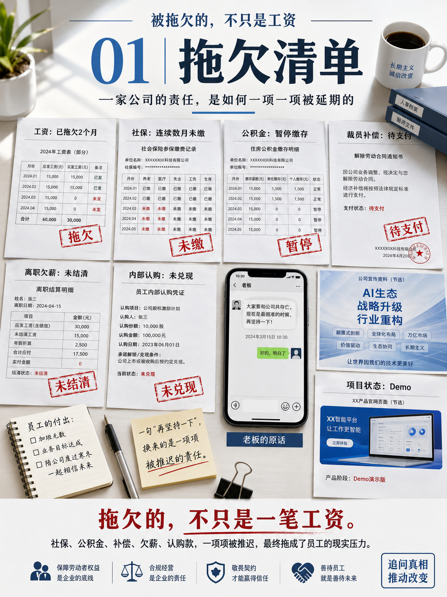
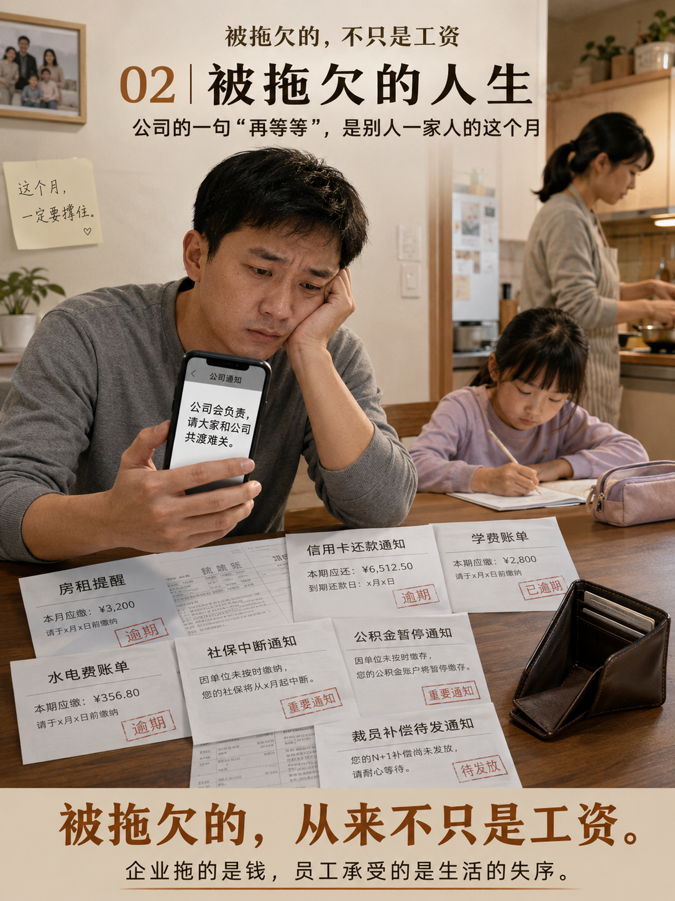
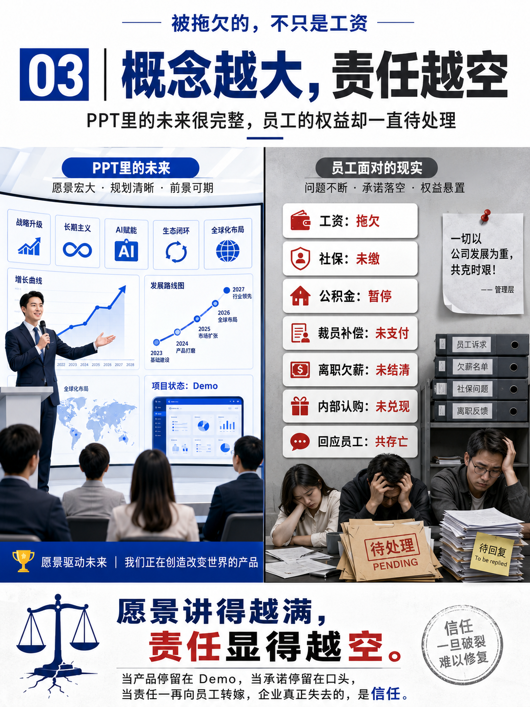

# **拖欠，正在成为这家公司的“经营方式”**

## ——工资不发、社保断缴、补偿拖延、空头承诺不断，XX数的问题早已不只是现金流

  

一家公司可以经营困难，
可以阶段性承压，
也可以在行业低谷里寻找出路。

但**困难不是拖欠的理由，压力也不是失责的借口。**

如果一家企业：

* **员工工资连续两个月发不出来；**
* **社保、公积金数月不缴；**
* **裁员后依法应给的补偿迟迟不付；**
* **已经离职的员工，连欠薪都一直拿不到；**
* **曾让员工自掏腰包认购所谓“公司股票”或“内部机会”，如今却又以各种理由拒绝兑现；**
* **当员工追问这些最基本的权益时，得到的不是清晰方案，而是“要和公司共存亡”“要有格局”“困难时期大家互相理解”的情绪绑架；**

那么，这家公司暴露出来的，就不再只是短期经营问题，
而是一种更根本的东西：

# **对责任的持续逃避。**

---

# 一、最该先兑现的，不是概念，而是工资

XX数对外一直很会讲故事。

它讲趋势，讲转型，讲智能化，讲平台，讲生态，讲未来。
概念一个接一个，方向一轮又一轮。
在演示材料里，它似乎永远站在行业前沿；
在路演和汇报里，它总能把“未来”讲得澎湃激昂。

但员工看到的现实却是：

* 工资一拖再拖；
* 社保、公积金长期断缴；
* 发薪时间从“本周”变成“下周”，再变成“尽快”；
* 一个又一个明确承诺，最后都被模糊处理。

一家公司真正的底色，不在宣传稿里，
也不在高管口中的愿景里，
而在它是否能兑现最基本的责任。

**工资按时发放，不是福利，是底线。**
**社保、公积金依法缴纳，不是恩赐，是义务。**

连底线都无法保障，
再宏大的叙事，也显得格外空洞。

---

# 二、项目长期停留在 Demo，员工却要为“未来”埋单

XX数另一个被反复提起的问题，是项目和产品本身。

表面上看，公司似乎做了很多“新东西”：

* 页面很炫；
* Demo 很完整；
* 方案很先进；
* PPT 很容易打动人；
* 概念包装得很前沿。

但真正能否在客户场景中稳定使用，
能否形成清晰业务闭环，
能否经得起真实业务的长期运行，
却是另一回事。

很多项目的问题在于：

* **更像展示品，而不是可持续使用的产品；**
* **更适合汇报，而不适合交付；**
* **更擅长制造“看上去很强”的效果，而不是解决真实问题。**

换句话说，
公司擅长做的是**“能演示的未来”**，
而不是**“能落地的现在”**。

讽刺的是，
这样的公司在产品上没有兑现，
在员工权益上也没有兑现。

**概念可以延期，Demo 可以重做，
但员工的工资、社保、生活成本，不会跟着一起暂停。**

---

  

# 三、裁员不补偿，离职仍欠薪：拖欠已经延伸到“人走之后”

如果说在职员工的工资拖欠，还能被包装成所谓“阶段性安排”，
那么对**被裁员工补偿迟迟不付**、
对**离职员工欠薪长期不结**，
则更直接暴露了一家公司在处理责任时的态度。

员工在岗时：

> “公司现在困难，大家理解一下。”

员工被裁后：

> “补偿后面统一处理。”

员工离职后：

> “工资会安排，不会少你的。”

听起来都像承诺，
但如果承诺总是没有日期、没有方案、没有兑现，
那它本质上就不是安排，
而是**拖延**。

更令人失望的是，
这些人已经离开公司，
不再享受所谓“未来红利”，
不再参与所谓“共同成长”，
可他们已经付出的劳动、应得的补偿，
却仍被公司长期悬置。

**人走了，账不能跟着消失。**
**关系结束了，责任不能跟着终止。**

---

# 四、让员工自掏钱买“空头股票”，最后却迟迟不给兑现

相比欠薪和补偿拖延，
让员工**自己出钱认购所谓股票、期权或内部权益**，
之后又迟迟不给明确兑现，
这件事更让人难以接受。

因为它不是单纯的未支付，
而是建立在**信任基础上的再次透支**。

员工为什么愿意掏钱？

通常是因为他们相信：

* 公司会发展；
* 高管说的话值得信任；
* 这是内部机会；
* 现在吃一点苦，未来会有回报。

但当现实变成：

* 钱先交了；
* 权益迟迟不落实；
* 兑现不断拖延；
* 一谈到明确处理，公司就给出各种理由；
* 最后甚至连解释都变成含糊和回避；

这就不只是“经营不顺”，
而是对员工信任的二次伤害。

工资拖欠，是透支员工的现实生活；
股票不兑，是透支员工对未来的想象。

**现实被拖欠，未来也被拖欠。**

---

# 五、最令人反感的，不是困难，而是用“共存亡”回应员工维权

公司困难时，员工当然可以理解一部分现实压力。
但“理解”从来不意味着：

* 放弃工资；
* 放弃社保；
* 放弃补偿；
* 放弃已经投入的钱；
* 放弃追问的权利。

更不能把员工要求合理权益，
反过来指责成：

* 不够忠诚；
* 没有大局观；
* 不能和公司共渡难关；
* 只顾个人利益。

这是最典型的情绪绑架。

当员工问：

> “工资什么时候发？”

公司回答：

> “要相信公司。”

员工问：

> “社保公积金什么时候补？”

公司回答：

> “现在是关键时期，要共克时艰。”

员工问：

> “裁员补偿、离职欠薪、员工认购的钱，到底怎么解决？”

公司回答：

> “大家要和公司共存亡。”

这不是沟通，
这是**把公司的经营风险转嫁给员工之后，
再要求员工为这种转嫁保持感恩。**

真正愿意和公司共担的人，
不该被公司拿来当作缓冲垫；
真正值得员工相信的公司，
也不会把“信任”当成拒绝兑现的工具。

---

  

# 六、拖欠不是偶发事件，而是一种管理惯性

当工资拖欠，
社保断缴，
补偿不付，
离职欠薪不结，
员工认购权益不兑，
这些问题持续出现，
而每一次回应都离不开：

* 下周；
* 尽快；
* 正在处理；
* 资金安排中；
* 大家再坚持一下；

那么外界看到的，就不是某一次偶发失误，
而是一种长期形成的管理惯性：

# **能拖就拖，能糊弄就糊弄，

能让员工先承担，就绝不自己先负责。**

这才是最危险的地方。

一个企业真正走向失控，
并不一定始于财务报表恶化，
而是始于：

* 对承诺越来越轻；
* 对员工越来越敷衍；
* 对责任越来越迟钝；
* 对“拖欠”越来越习以为常。

---

# 七、公司可以没有高速增长，但不能没有基本担当

并不是所有公司都能成功，
也不是所有项目都能商业化。
创业失败、方向判断错误、市场环境变化，
这些都可以被理解。

但不能被理解的是：

* 用员工工资维持体面；
* 用拖欠社保换取账面喘息；
* 用补偿延期缓冲裁员成本；
* 用“内部股票”继续榨取员工信任；
* 用“共存亡”去堵住合理追问。

**经营可以失败，
责任不能失踪。**

**商业模式可以调整，
已经形成的义务不能重写。**

---

# 结语：被拖欠的，不只是钱

XX数真正伤害员工的，
不只是两个月工资，
不只是几个月社保、公积金，
也不只是那一笔迟迟不处理的补偿和投入。

它拖欠的还有：

* 员工对公司的信任；
* 对职业尊严的基本期待；
* 对“承诺”这两个字的最后一点相信。

一家企业最怕的，
不是暂时没钱，
而是让所有人逐渐意识到：

> **它不是暂时兑现不了，
> 而是习惯性地不想负责。**

当“下周发”成为常态，
当“再等等”成为制度，
当“共存亡”成为推责话术，
那么这家公司真正需要反思的，
已经不是融资、市场、战略和概念，
而是：

# **它是否还配得上员工曾经给过的信任。**

